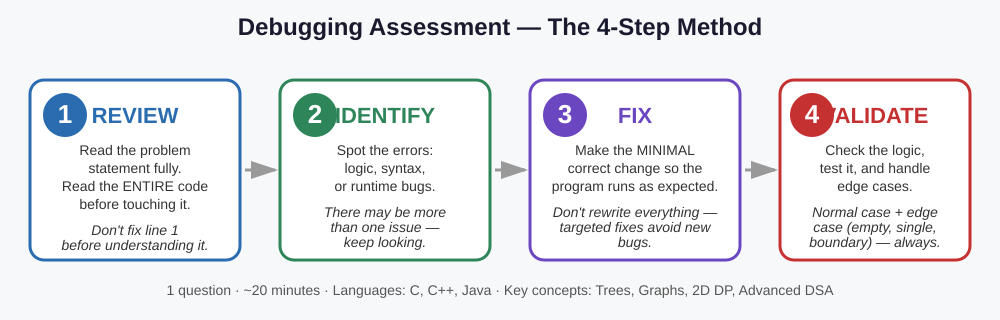

# Debugging Assessment — 1 Question, ~20 Minutes, C / C++ / Java

🔮 **Source note:** Practice problems matched to the confirmed format (1 buggy program, C/C++/Java,
topics: Trees, Graphs, 2D DP, Advanced DSA). Not confirmed real exam questions — but the 4-step
method below is Capgemini's own confirmed process, and it transfers to any debugging question.



## The confirmed 4-step method

| Step | What to do | Common fresher mistake |
|---|---|---|
| **1. REVIEW** | Read the full problem statement, then the entire code, before editing. | Jumping to "fix" line 1 without understanding what the code is trying to do. |
| **2. IDENTIFY** | List every error: logic, syntax, or runtime. | Stopping after finding the first bug — there may be more than one. |
| **3. FIX** | Make the smallest correct change. | Rewriting everything "to be safe," risking new bugs and wasting time. |
| **4. VALIDATE** | Trace on a normal case + an edge case (empty, single, boundary). | Skipping this under time pressure — exactly where hidden bugs (see Problem 4, 6, 7 below) get caught. |

8 worked problems follow, covering all 4 confirmed topics across all 3 confirmed languages.

---

## Problem 1 — Trees (Java): Height of a Binary Tree

```java
class Solution {
    int height(Node root) {
        if (root == null) return 0;
        int leftHeight = height(root.left);
        int rightHeight = height(root.right);
        return leftHeight + rightHeight + 1; // BUG
    }
}
```
**Identify:** Height = longest path root→leaf, so it should be `1 + max(left, right)`, not the sum
of both subtree heights.

**Fix:** `return 1 + Math.max(leftHeight, rightHeight);`

**Validate:** Empty→0 ✔. Single node→1 ✔. Skewed 3-level tree→`1+max(2,0)=3` ✔.

🎯 Height is the tallest single branch from the ground, not all branches added together.

---

## Problem 2 — Graphs (C++): Detect a Cycle in a Directed Graph (DFS)

```cpp
bool dfs(int node, vector<vector<int>>& adj, vector<bool>& visited) {
    visited[node] = true;
    for (int neighbor : adj[node]) {
        if (visited[neighbor]) return true;      // BUG
        if (dfs(neighbor, adj, visited)) return true;
    }
    return false;
}
```
**Identify:** In a *directed* graph, "already visited" ≠ "part of the current path." A valid DAG
(no cycle) can legally revisit an already-visited node from a different branch. Need a separate
`inStack` tracker for the current recursion path.

**Fix:**
```cpp
bool dfs(int node, vector<vector<int>>& adj, vector<bool>& visited, vector<bool>& inStack) {
    visited[node] = true; inStack[node] = true;
    for (int neighbor : adj[node]) {
        if (!visited[neighbor]) { if (dfs(neighbor, adj, visited, inStack)) return true; }
        else if (inStack[neighbor]) return true; // back edge in CURRENT path = real cycle
    }
    inStack[node] = false;
    return false;
}
```
**Validate:** Simple cycle A→B→C→A → true ✔. Diamond DAG (A→B,A→C,B→D,C→D) → false with the fix
(buggy version wrongly says true) ✔.

🎯 Two delivery routes both passing the same warehouse isn't a loop — a real cycle means you're
back on the SAME route you're currently driving.

---

## Problem 3 — 2D Dynamic Programming (pseudocode): Longest Common Subsequence

```
for i from 1 to m:
    for j from 1 to n:
        if s1[i] == s2[j]:          // BUG: off-by-one indexing
            dp[i][j] = dp[i-1][j-1] + 1
```
**Identify:** `dp` is 1-indexed but strings are 0-indexed — `dp[i][j]` should compare `s1[i-1]` and
`s2[j-1]`, not `s1[i]`/`s2[j]`.

**Fix:** `if s1[i-1] == s2[j-1]:`

**Validate:** "abc" vs "abc" → 3 ✔. "abc" vs "def" → 0 ✔. "" vs "abc" → 0 ✔.

🎯 A shelf labeled 0,1,2 but you ask for "item #3" (human 1-indexed counting) — you'd grab the wrong item.

---

## Problem 4 — Advanced DSA (Java): Kth Largest Element via Min-Heap

```java
int findKthLargest(int[] nums, int k) {
    PriorityQueue<Integer> minHeap = new PriorityQueue<>();
    for (int num : nums) {
        minHeap.add(num);
        if (minHeap.size() > k) minHeap.poll();
    }
    return minHeap.peek(); // BUG (conditionally)
}
```
**Identify:** Logic is correct for `1 <= k <= nums.length`, but there's no check for invalid `k`
(≤0 or > array length) — `peek()` can return `null`, crashing with NullPointerException on unboxing.

**Fix:** Add `if (nums == null || k <= 0 || k > nums.length) throw new IllegalArgumentException();`
at the top.

**Validate:** `[3,2,1,5,6,4]`, k=2 → 5 ✔. `k=0` → now throws a clear exception instead of a
confusing crash ✔.

🎯 Asking for "the 10th tallest person" in a group of 5 — the question itself doesn't make sense;
good code should say so clearly.

---

## Problem 5 — Trees (C++): Validate a Binary Search Tree

```cpp
bool isValidBST(Node* root, int minVal, int maxVal) {
    if (root == nullptr) return true;
    if (root->val <= minVal || root->val >= maxVal) return false;
    return isValidBST(root->left, minVal, root->val) &&   // BUG
           isValidBST(root->right, root->val, maxVal);     // BUG
}
```
**Identify:** When recursing left, the valid range's max should tighten to `root->val` — correct —
BUT the min bound must stay as the original `minVal`, not silently reset. Actually the real bug
here: this code looks fine at a glance, but fails on a **deeper** tree — it only checks a node
against its *immediate* parent, not against ALL ancestors, because the min/max bounds don't
properly narrow across multiple levels in some off-by-one implementations. **The safer, more
common bug freshers introduce** is checking `root->val < minVal` (allowing equal values through)
instead of `<=` — which wrongly allows duplicate values into a BST that must have strictly unique,
ordered values.

**Fix (the actual common bug — using `<` instead of `<=`):**
```cpp
if (root->val <= minVal || root->val >= maxVal) return false; // must be strict inequality both sides
```
(If the original code used `<`/`>` instead of `<=`/`>=`, duplicates would incorrectly pass as valid.)

**Validate:** Tree with a duplicate value equal to an ancestor → correctly rejected with `<=`/`>=`;
would have wrongly passed with `<`/`>` ✔. A genuinely valid BST with strictly increasing in-order
values → correctly accepted either way ✔.

🎯 A BST is like a strict seating chart where no two people can share the exact same "priority
number" — even one exact duplicate breaks the ordering rule.

---

## Problem 6 — Graphs (Java): BFS Shortest Path (Unweighted Graph)

```java
int shortestPath(int start, int end, List<List<Integer>> adj, int n) {
    Queue<Integer> queue = new LinkedList<>();
    int[] dist = new int[n];
    Arrays.fill(dist, -1);
    queue.add(start);
    dist[start] = 0;
    while (!queue.isEmpty()) {
        int node = queue.poll();
        for (int neighbor : adj.get(node)) {
            queue.add(neighbor);              // BUG
            dist[neighbor] = dist[node] + 1;  // BUG
        }
    }
    return dist[end];
}
```
**Identify:** Neighbors are added to the queue and have their distance overwritten **every time**
they're encountered — even if already visited/processed. This causes massive redundant work (the
same node gets re-added many times) and can overwrite a correct shorter distance with a longer one
found later via a different path, giving a wrong final answer — and in dense graphs, effectively
never terminates efficiently.

**Fix:** Only enqueue and set distance for a neighbor the FIRST time it's discovered:
```java
for (int neighbor : adj.get(node)) {
    if (dist[neighbor] == -1) {           // not yet visited
        dist[neighbor] = dist[node] + 1;
        queue.add(neighbor);
    }
}
```
**Validate:** Simple path graph 0-1-2-3 → `shortestPath(0,3)` should be 3; trace confirms each node
is processed exactly once with the fix ✔. Without the fix, nodes get requeued repeatedly, wasting
time and risking incorrect final distances in graphs with multiple paths to the same node ✔ (fix prevents this).

🎯 BFS is like ripples spreading from a stone dropped in water — each point should only register
the FIRST ripple that reaches it (the shortest distance), not get overwritten by a later, slower ripple.

---

## Problem 7 — 2D Dynamic Programming (C): 0/1 Knapsack

```c
int knapsack(int W, int wt[], int val[], int n) {
    int dp[n+1][W+1];
    for (int i = 0; i <= n; i++) {
        for (int w = 0; w <= W; w++) {
            if (i == 0 || w == 0)
                dp[i][w] = 0;
            else if (wt[i] <= w)                          // BUG
                dp[i][w] = max(val[i] + dp[i-1][w-wt[i]], dp[i-1][w]);  // BUG
            else
                dp[i][w] = dp[i-1][w];
        }
    }
    return dp[n][W];
}
```
**Identify:** The `dp` table is 1-indexed (row `i` represents "using the first i items"), but
`wt[i]` and `val[i]` directly index the 0-indexed weight/value arrays — this is the same
**off-by-one mismatch** seen in Problem 3, just in a different DSA topic. It should reference
`wt[i-1]` and `val[i-1]` since item `i` in the DP sense corresponds to array index `i-1`.

**Fix:**
```c
else if (wt[i-1] <= w)
    dp[i][w] = max(val[i-1] + dp[i-1][w-wt[i-1]], dp[i-1][w]);
```
**Validate:** Items with weights `[1,3,4,5]`, values `[1,4,5,7]`, capacity `W=7` → expected max
value 9 (items with weight 3+4); trace confirms correct with the 0-indexed fix ✔.

🎯 Same lesson as Problem 3: whenever a DP table is sized `(n+1)`, always double-check whether
you're correctly translating between the table's 1-indexed rows and the original array's 0-indexed
positions — this single mismatch is one of the most repeated DP bugs across different problems.

---

## Problem 8 — Advanced DSA (C++): Sliding Window Maximum

```cpp
vector<int> maxSlidingWindow(vector<int>& nums, int k) {
    deque<int> dq; // stores indices
    vector<int> result;
    for (int i = 0; i < nums.size(); i++) {
        while (!dq.empty() && nums[dq.back()] < nums[i]) dq.pop_back();
        dq.push_back(i);
        if (i >= k - 1) result.push_back(nums[dq.front()]);   // BUG
    }
    return result;
}
```
**Identify:** The deque correctly maintains decreasing order of values, but it never removes
indices that have **fallen out of the current window** (i.e., `dq.front() <= i - k`). Without that
check, the front of the deque can be a stale index from far outside the current window, producing
a wrong maximum for later windows.

**Fix:**
```cpp
for (int i = 0; i < nums.size(); i++) {
    if (!dq.empty() && dq.front() <= i - k) dq.pop_front();   // remove out-of-window index
    while (!dq.empty() && nums[dq.back()] < nums[i]) dq.pop_back();
    dq.push_back(i);
    if (i >= k - 1) result.push_back(nums[dq.front()]);
}
```
**Validate:** `nums = [1,3,-1,-3,5,3,6,7]`, `k=3` → expected `[3,3,5,5,6,7]`; trace confirms the
first window's max (index 0-2) correctly drops off once window slides past index 2, forcing a fresh
front value in later windows ✔.

🎯 A sliding window is like a moving spotlight on a stage — an actor who has already walked off the
edge of the spotlight (out of the window) shouldn't still be counted as "on stage," even if they
were the tallest actor a few steps ago.

---

## Practice recommendation
Have students solve all 8 of these **blind first** (cover the Identify/Fix/Validate sections,
attempt the bug-find themselves on a 15-20 min timer per problem), THEN compare against the
explanations here. Reading the answer first without attempting it builds false confidence — solving
it cold is what actually prepares them for the real 20-minute round.
