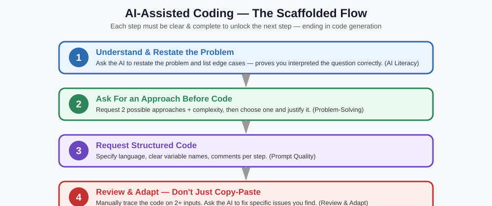

# AI-Assisted Coding Assessment

🔮 **Source note:** Practice guide matched to the confirmed format from the slide. Not confirmed
real exam content — but the evaluation criteria below ARE confirmed from the slide, and that's
what students should train against.

## Confirmed format (from the slide)
- **Focus:** Use an AI assistant effectively to solve coding problems, quickly and efficiently —
  not just to reach the final answer.
- **Scaffolding flow:** Step-by-step. Clear, correct, complete input at each step unlocks the next
  — ending in code generation. Sloppy input at an early step can block progress.
- **What is evaluated (4 things):**
  1. **AI literacy** — understanding & interpreting the question, responding meaningfully
  2. **Prompt quality** — structured, relevant prompts over random one-liners
  3. **Problem-solving** — choosing the right approach, guiding the AI
  4. **Review & adapt** — checking/improving code, not just copy-pasting

## The single biggest mistake freshers make
Treating the AI like a magic answer box: pasting the raw problem statement with zero structure,
accepting the first output with no review, moving on. This round explicitly penalizes exactly that.

---

## The 4-step scaffolded flow (rehearse this every time)

**Step 1 — Understand & restate (AI literacy).**
*"Before writing code, restate this problem in your own words and list edge cases I should
consider: [paste problem]."*

**Step 2 — Ask for an approach before code (problem-solving).**
*"Don't write code yet. What are 2 possible approaches, and what's the time/space complexity of
each? Which would you recommend and why?"*

**Step 3 — Request structured code (prompt quality).**
*"Implement the [chosen] approach in [language]. Use clear variable names, comment each major
step, and note the time/space complexity at the top."*

**Step 4 — Review & adapt (this is the step most students skip).**
*"Trace through this code manually with input X. Does it handle an empty input? A single-element
input? Are there lines that could throw an exception?"* — then personally read the code and be
ready to explain every line.

---

## Practice Scenario 1: Palindrome Check

**Task:** Check if a string is a palindrome, ignoring case and spaces.

❌ **Weak prompt:** `"palindrome check"`
✅ **Strong prompt:** *"Write a Python function `is_palindrome(s: str) -> bool` that checks if a
string is a palindrome, ignoring case and spaces (e.g., 'Nurses Run' → True). Handle empty strings
(→ True). Add a docstring and 3 test cases: a normal palindrome, a normal non-palindrome, an edge case."*

**Why the strong prompt scores well:** language + exact signature + the ignore-case/space rule with
an example + explicit edge case + self-testing request — exactly "structured, relevant" prompting.

---

## Practice Scenario 2: Two-Sum Problem

**Task:** Given an array and a target, find two numbers that add up to the target.

**Step 1 prompt:** *"Restate this problem and list edge cases: given an array of integers and a
target, return indices of two numbers that add up to the target. Assume exactly one solution exists."*
→ A good AI literacy response should surface: what if no pair exists (contradicts assumption, but
still worth noting), duplicate values in the array, negative numbers.

**Step 2 prompt:** *"What are 2 approaches — brute force vs. hash map — and their complexity?"*
→ Should get: brute force O(n²)/O(1) space vs. hash map O(n)/O(n) space, with hash map recommended
for efficiency.

**Step 4 review prompt (the critical one):** *"Trace this with nums=[3,3], target=6 — does it
correctly return both indices even though the values are identical?"* — this specific edge case
(duplicate values) is exactly where naive hash-map implementations sometimes fail if they check
"does target-num exist" using the same index before storing it.

---

## Practice Scenario 3: Merge Two Sorted Arrays (In-Place)

**Task:** Merge two sorted arrays into one, without using extra space.

**Step 1 prompt:** *"Restate this problem: merge two sorted arrays nums1 (with extra trailing
space) and nums2 into nums1, in sorted order, without extra space. List edge cases."*
→ Should surface: one array is empty, arrays of very different sizes, duplicate values across both arrays.

**Step 3 prompt:** *"Implement this in Java using a three-pointer approach starting from the END of
both arrays (to avoid overwriting unprocessed elements). Comment each pointer's role."*
→ Teaches students WHY starting from the end matters here — a common approach-selection insight
worth explicitly asking the AI to explain, not just accepting silently.

**Step 4 review prompt:** *"Walk through nums1=[1,2,3,0,0,0], m=3, nums2=[2,5,6], n=3 step by
step."* — forces a full manual trace, not a "looks fine" glance.

---

## Practice Scenario 4: Find the First Non-Repeating Character

**Task:** Given a string, return the first character that doesn't repeat.

**Step 2 prompt:** *"What are 2 approaches for finding the first non-repeating character — one
using nested loops, one using a hash map/frequency count? Compare their time complexity."*
→ Should get: nested loop O(n²), hash map (count frequencies, then scan for first count==1) O(n).

**Common review catch (Step 4):** Ask the AI: *"What does this return if every character repeats
(e.g., 'aabbcc')?"* — a fresher-level mistake is not handling the "no such character" case (should
return something like `-1`, `None`, or a specific sentinel, clearly documented) — exactly the kind
of edge case Step 4 is designed to surface.

---

## Practice Scenario 5: Implement a Basic LRU Cache

**Task:** Design a Least Recently Used (LRU) cache with `get` and `put` operations in O(1) time.

**Step 1 prompt:** *"Restate this problem in your own words, and explain why a plain hash map alone
isn't enough to solve it in O(1) for both get and put with eviction."*
→ A good response should explain: you need BOTH a hash map (O(1) lookup) AND a doubly linked list
(O(1) reordering to track recency) together — this is a genuinely more advanced DSA insight worth
having the AI teach, not just generate blindly.

**Step 2 prompt:** *"Confirm the approach: HashMap + Doubly Linked List. What does each data
structure's role need to be?"*

**Step 4 review prompt:** *"Trace a sequence: put(1,1), put(2,2), get(1), put(3,3) [should evict key
2 as least recently used since key 1 was just accessed], then get(2) [should return -1/not
found]."* — this is a genuinely hard trace to do manually, which is exactly why it's valuable
practice — testing whether the student actually understands recency tracking, not just whether
code was pasted successfully.

---

## Practice Scenario 6: Merge Overlapping Intervals

**Task:** Given a list of intervals, merge all overlapping ones.

**Step 1 prompt:** *"Restate this problem and list edge cases: given intervals like
[[1,3],[2,6],[8,10],[15,18]], merge all overlapping intervals."*
→ Should surface: intervals given out of order (need sorting first), touching-but-not-overlapping
intervals (e.g., [1,3] and [3,5] — do they count as overlapping? — a genuinely ambiguous edge case
worth clarifying with the AI rather than assuming), a single interval, an empty list.

**Step 2 prompt:** *"What's the approach — sort first, then do a single linear pass comparing each
interval to the last one in the result list? What's the time complexity?"*
→ Should get: O(n log n) due to the sort dominating an otherwise O(n) merge pass.

**Step 4 review prompt:** *"Trace this with [[1,3],[2,6],[8,10],[15,18]] step by step, showing the
result list after each interval is processed."* — full manual trace, not a glance-and-accept.

---

## Self-check rubric (use this for every practice scenario above)

| Criterion | What "good" looks like |
|---|---|
| AI literacy | Can explain, in own words, what the problem asks and what edge cases exist — before code exists |
| Prompt quality | Prompts specify language, signature/input-output, constraints, edge cases — never one-liners |
| Problem-solving | Compares at least one alternative approach and justifies the chosen one (mentions complexity) |
| Review & adapt | Manually traces the generated code on 2+ inputs; can point to (or ask the AI to fix) a specific issue — never a blind "looks good" |

## More tasks to rehearse the flow on (once the 6 above feel comfortable)
7. Check if two strings are anagrams of each other.
8. Reverse a linked list, iteratively and recursively.
9. Find the kth smallest element in an unsorted array.
10. Detect if a linked list has a cycle (Floyd's algorithm).

**Hard rule for every practice run:** no pasting the raw problem as-is into the AI — every prompt
must be restructured first, following the 4-step flow above.
